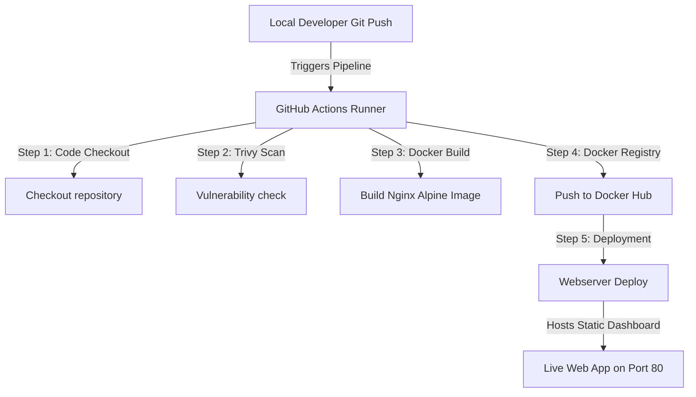

# NexGen DevOps Production Project & Mission Control Dashboard

[](https://github.com/Imranbashir340/devops-production-projects/actions)
[](https://hub.docker.com/r/imranbashir340/devops-prod-app)
[](https://nginx.org)
[](https://opensource.org/licenses/MIT)

Welcome to the **NexGen DevOps Production Project**! This project showcases a high-fidelity **Mission Control Dashboard** that simulates real-time CI/CD workflows, tracks system resource telemetry, and monitors service statuses. It is fully containerized using an optimized, health-checked Nginx Alpine base image and integrated with an automated GitHub Actions CI/CD deployment pipeline.

---

## 🚀 Key Features

*   **Interactive DevOps Dashboard**: An elegant, glassmorphic dark-theme console (`#080b11`) powered by responsive web standards, premium typography (*Outfit*, *JetBrains Mono*), and fluid CSS micro-animations.
*   **CI/CD Pipeline Simulator**: Fully interactive step-by-step visual representation of the repository's CI/CD pipeline (Git Commit ➜ Security Scan ➜ Docker Build ➜ Push Registry ➜ Webserver Deploy).
*   **Live Action Logs Console**: A scrollable retro terminal displaying colorized, simulated GitHub Actions runner logs executing in real-time as the simulator runs.
*   **System Telemetry Monitors**: Dynamic, live-updating CPU, RAM, and Network I/O metrics using SVG line charts and progress animations.
*   **Interactive Outage Simulator**: Trigger simulated resource spikes (99% CPU/RAM) and network timeouts to observe how the healthcheck indicator dynamically switches from green to red!
*   **Production-Grade Containerization**: Docker base optimized with explicit OCI (Open Container Initiative) metadata labels, secure asset permissions, and a runtime `HEALTHCHECK` monitor.

---

## 🛠️ Architecture & Technologies



*   **Hosting Webserver**: [Nginx 1.25-alpine](https://hub.docker.com/_/nginx) (Ultra lightweight, safe, and secure base)
*   **Build Automation**: GitHub Actions Runner (Ubuntu Latest)
*   **Security & Compliance**: Standard file permissions & container health checking
*   **Styling & Design System**: Modern, self-contained CSS featuring glassmorphism, responsive grid layouts, custom HSL color maps, and glowing drop shadows.

---

## 🏃 Local Deployment Quickstart

Follow these simple steps to build and run the optimized container locally:

### 1. Prerequisites
Ensure you have [Docker Desktop](https://www.docker.com/products/docker-desktop/) installed on your machine.

### 2. Clone the Repository
```bash
git clone https://github.com/Imranbashir340/devops-production-projects.git
cd devops-production-projects
```

### 3. Build the Docker Image
Build the image locally using the optimized `Dockerfile`:
```bash
docker build -t devops-prod-app:latest .
```

### 4. Run the Container
Launch the container and map port `80` to your host's port `8080`:
```bash
docker run -d -p 8080:80 --name my-devops-dashboard devops-prod-app:latest
```

### 5. Access the Dashboard
Open your preferred web browser and navigate to:
👉 **[http://localhost:8080](http://localhost:8080)**

---

## 🤖 CI/CD Pipeline Configuration

The automated pipeline is defined in `.github/workflows/docker-ci.yml`. On every `push` to the `main` branch, the workflow:
1.  **Checks out** the source code.
2.  **Logs into** Docker Hub securely using stored encrypted secrets.
3.  **Tags the image** dynamically using the unique 7-character Git commit hash (`IMAGE_TAG=${GITHUB_SHA::7}`).
4.  **Builds** the Docker context using cached layers.
5.  **Pushes** the finalized production-ready image to your Docker Hub repository.

### Configuring GitHub Secrets
To allow the pipeline to successfully push images to your Docker Hub registry, add the following **Repository Secrets** in GitHub (`Settings -> Secrets and Variables -> Actions`):

| Secret Name | Description | Example Value |
| :--- | :--- | :--- |
| `DOCKER_USERNAME` | Your official Docker Hub username | `imranbashir340` |
| `DOCKER_PASSWORD` | Docker Hub Personal Access Token (PAT) | `dckr_pat_xxxxxxx...` |

---

## 🔒 Container Security & Health Checks

Our `Dockerfile` implements key enterprise deployment configurations:
*   **Explicit File Permissions**: Restricts static assets (`index.html`) using `chmod 644` to prevent unauthorized write permissions at runtime.
*   **Metadata Integration**: Embedded standard OCI labels for simple registry searching and tracking.
*   **Runtime Healthcheck**:
    ```dockerfile
    HEALTHCHECK --interval=30s --timeout=5s --start-period=10s --retries=3 \
      CMD wget --no-verbose --tries=1 --spider http://localhost/ || exit 1
    ```
    This ensures that orchestrators (like Kubernetes or Docker Swarm) automatically detect if the Nginx process freezes and can replace it immediately with a healthy replica.

---

## 👤 Author
Developed and maintained with 💻 by **[Imran Bashir](https://github.com/Imranbashir340)**. Feel free to open issues or pull requests to expand telemetry metrics!
